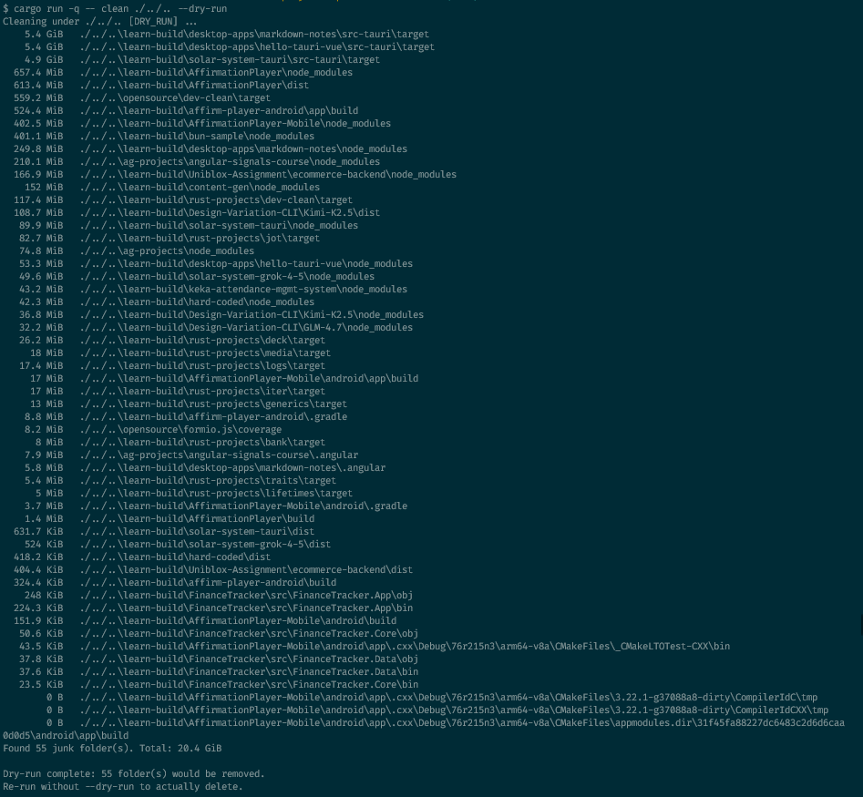
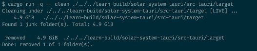

# 🧹artifactsweep

- **Artifact Sweep** is a cross-platform Rust-based disk cleanup utility that safely removes generated development artifacts to reclaim storage space.

- Generally, the artifcats are (`node_modules`, `target`, `dist`, and more) under a path you choose.

## Install

### Option A - Prebuilt binary (no Rust required)

1. Open [Releases](https://github.com/kksrini89/artifactsweep/releases)
2. Download the asset for your OS:

| OS | Asset (example) |
|----|------------------|
| Windows x64 | `sweep-windows-x86_64.exe` |
| Linux x64 | `sweep-linux-x86_64` |
| macOS | `sweep-macos` |

3. (Linux/macOS) Make it executable and move it onto your `PATH` if you like:

   ```bash
   chmod +x sweep-linux-x86_64   # or sweep-macos
   sudo mv sweep-linux-x86_64 /usr/local/bin/sweep

4. On Windows, rename to sweep.exe if you want, then place it in a folder that is on your PATH, or run it by full path.

5. Check:

```sweep --help```


### Pre-requisite for Option B & C

- Rust / Cargo ([rustup](https://rustup.rs))

### Option B — From source (Rust / Cargo)

```bash
git clone https://github.com/kksrini89/artifactsweep.git
cd dev-clean
cargo install --path .
dev-clean --help
```

### Option C — Build only

```bash
cargo build --release
# Windows: target/release/sweep.exe
# Linux/macOS: target/release/sweep
```

## Build & run

From the project directory:

```bash
cargo build
cargo run -- scan <PATH>
cargo run -- clean <PATH> --dry-run
cargo run -- clean <PATH>
```

Release binary:

```bash
cargo build --release
./target/release/sweep scan <PATH>    # Git Bash / Unix-style
```

Optional install (puts dev-clean on your PATH):

```bash
cargo install --path .
sweep scan <PATH>
```

## Commands

#### scan

List artifact folders under PATH (read-only).

```bash
sweep scan .
sweep scan /d/projects/opensource
```

#### clean

Delete the same artifact folders scan would find.

Preview first (recommended):

```bash
sweep clean <PATH> --dry-run
```

Delete for real:
```bash
sweep clean <PATH>
```

#### Paths in Git Bash

Prefer forward-slash or Git Bash paths so \ is not eaten by the shell:

```bash
sweep scan /d/Personal/projects/my-app
sweep scan D:/Personal/projects/my-app
sweep scan 'D:\Personal\projects\my-app'   # quoted backslashes OK
```

#### Help

```bash
sweep --help
sweep scan --help
sweep clean --help
```

#### What counts as junk?

Folders are matched by directory name only (anywhere under `PATH`). When a match is found, the tool does not walk inside it for further artifact names.

Defined in [`src/junk.rs`](see `src/junk.rs`):

### JavaScript / TypeScript

- `node_modules`
- `dist`
- `build`
- `.angular`
- `.next`
- `.nuxt`
- `.turbo`
- `.cache`
- `.parcel-cache`
- `.svelte-kit`
- `.vite`

### Rust

- `target`

### Python

- `__pycache__`

### Java / Kotlin

- `.gradle`

### C# / .NET

- `bin`
- `obj`

### Flutter / Dart

- `.dart_tool`

### Generic

- `coverage`
- `out`
- `tmp`
- `temp`

> ***Warning***: Names like bin, obj, tmp, temp, out, and build appear in many stacks. 
> Always run scan or clean --dry-run before a live clean on a large or unfamiliar tree. Parent project folders are kept; only matching directories are removed.


### Notes

- Sizing uses parallel workers with `rayon` crate + progress bar with `indicatif` crate
- Prebuilt macOS builds come from GitHub’s macos-latest runner (often Apple Silicon). If a binary does not run on your Mac, build from source with Option B.

## Screenshots

On one of my project folders alone, it reclaimed nearly 5 GB of storage.





## License

MIT — see [LICENSE](LICENSE).